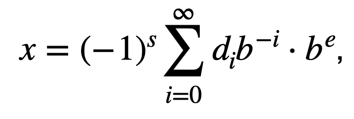

## Scientific Notation
### real number representation

The above expression means

A real number can be represented by

where $`s\in \{0, 1\}`$, $`b \ge 2`$, $`i \in \{0, 1, 2, ...\}`$, $`d_i\in \{ 0, ..., b-1 \}`$ 
and  $`d_0 > 0`$ when $`x \ne 0`$, $`b`$ and $`e`$ are integers.

For example: $`G \approx 6.674×10^{−11} m^3⋅kg^{−1}⋅s^{−2}`$

$`(6 \times 10^{0} + 6 \times 10^{-1} + 7 \times 10^{-2} + 4 \times 10^{-3})\times 10^{-11}`$
