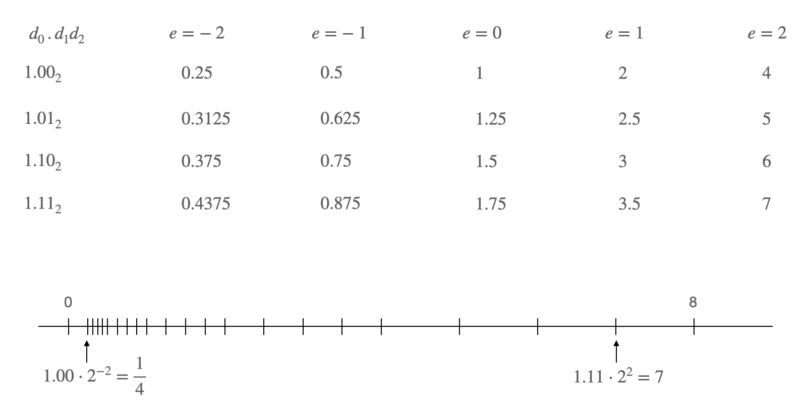

# Normalized Representation

Normalized number:

$`\pm d_0.d_1 ... d_{p-1} \times b^e`$, $`d_0 \ne 0`$

The normalized representation is unique and therefore preferred.

The number 0, as well as all numbers smaller than $`b^{e_{min}}`$, have no normalized representation.

Set of normalized numbers:

$`F^*(b, p, e_{min}, e_{max})`$

Exercise 1: Check machine limits for integer and floating-point types

Exercise 2: Write a function

 * input two floating-point numbers and their difference 
 * check whether this is indeed the correct difference
 * test it for the following types:
   * float, np.float32, np.float64
   *  and values: 1. and 1.5; 1.1 and 1.
