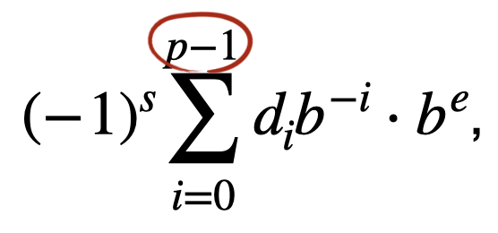

# Floating-point Number Systems
A finite floating point number system is a finite subset of $`R`$.

Floating-point number system is defined by the four natural numbers: 
 
 * $`b\ge 2`$, the radix, (2 or 10)
 * $`p\ge 1`$, the precision (the number of of digits in the significand)
 * $`e_{min}`$, the largest possible exponent
 * $`e_{max}`$, the smallest possible exponent, (shall be  for all formats)

Notation:

$`F(b,p, e_{min}, e_{max})`$

The set $`F(b,p, e_{min}, e_{max})`$ of real numbers represented by this system consists of all floating-point numbers of the form:

$`s \in \{ 0, 1 \} `$, $`d_i \in \{ 0, ... , b - 1 \}`$ for all $`i`$, $`e \in \{ e_{min}, ... , e_{max} \}`$ 

represented in radix $`b`$:

$`\pm d_0.d_1 ... d_{p-1} \times b^e`$.

Representation of the decimal number $`0.1`$ with $`b = 10`$:

$`1.0 \times 10^{-1}, 0.1 \times 10^0, 0.01 \times 10^1, ...`$

Different representation due to choise of exponent

